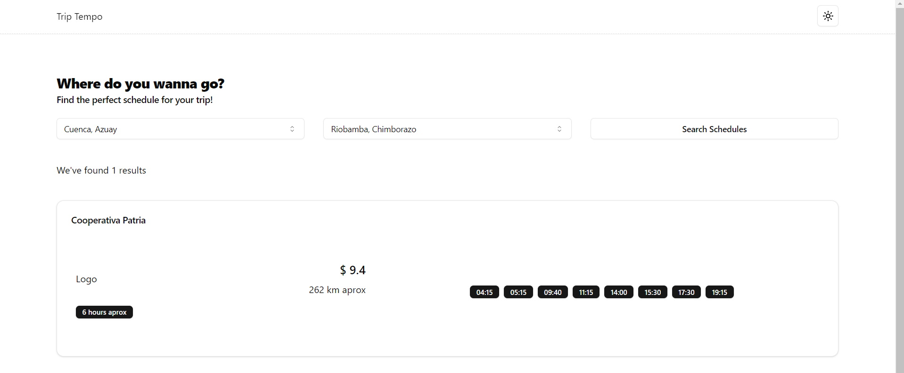
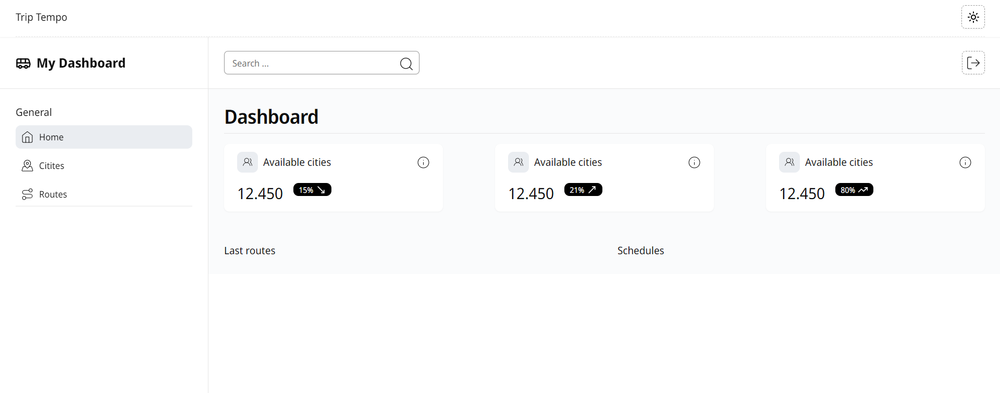

# Trip Tempo App

This project presents an application that allows the user to consult Cooperative schedules between different cities in Ecuador, the application shows the available schedules of the different cooperatives between two cities.

## My process

### Built with

- [Frontend](./next-triptempo-app/README.md)
- [Backend](./node-triptempo-server/README.md)

## Development Features

-

## Improves

- Include maps (routes)
- Include offices and terminals locations
- Trasnportation model car (seats, etc)
- Offices schedules
- Routes stops (cities without buses terminals)
- Round trip (round trip)
- Find option closest to the current time.
- Variable price
- Join cities to create different routes
- Same origin and destination with different routes (Sierra or Costa for example)
- Add round trips

## TODO:

- Define an schema to control errors and success data fron API

## Trip Tempo App

<table>
  <tr>
    <td align="center" valign="center"></td>
    <td align="center" valign="center"></td>
  </tr>
</table>

## Stay in touch

- Website - [www.bryan-aguilar.com](https://www.bryan-aguilar.com/)
- Medium - [baguilar6174](https://baguilar6174.medium.com/)
- LinkedIn - [baguilar6174](https://www.linkedin.com/in/baguilar6174)
